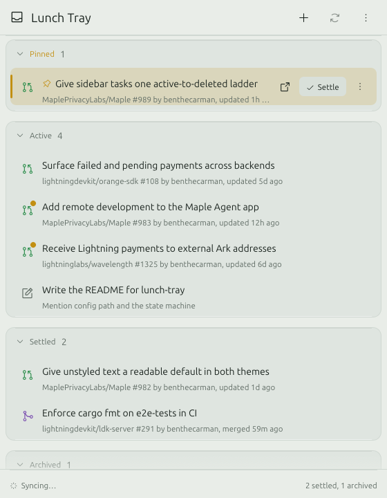
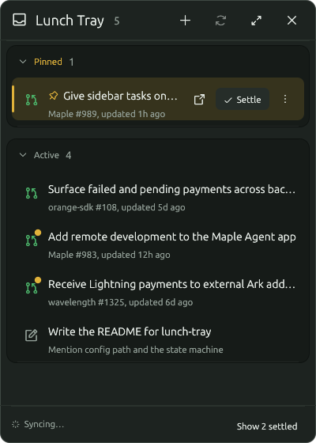

# Lunch Tray

A system tray todo list for Ubuntu. It follows your pull requests and issues
on GitHub and Forgejo, lets you add your own tasks, and lets you settle,
archive, and delete them. Written in Rust with egui and a StatusNotifierItem
tray icon.




## Features

- Tray icon. Left click opens a compact popover with the pinned and active
  tasks. Right click shows a short native menu: open, add, sync, quit. A badge
  on the icon shows new activity or a sync error.
- Full window with Pinned, Active, Settled, and Archived sections.
- GitHub and Forgejo (or Gitea) sync. New open items become tasks. Closed or
  merged items settle on their own. New activity on a settled item wakes it.
- Manual tasks with notes and a link.
- The window is a tray: a mint-grey melamine surface with a recessed
  compartment per section, and mustard for the few things that need
  attention. Light and dark mode share the palette, so both read as the same
  design. Follows the system through the desktop portal, or set it in the
  window menu.
- Uses the desktop's Ubuntu font when installed and Phosphor icons.

## Build and install

Requires Rust 1.95 or newer (`rust-toolchain.toml` pins 1.96.1). No system
development headers are needed.

```sh
git clone https://github.com/benthecarman/lunch-tray
cd lunch-tray
cargo install --path . --locked
```

That puts `lunch-tray` in `~/.cargo/bin`. To run it as a user service that
starts with your desktop session and lives in the tray:

```sh
install -Dm644 assets/lunch-tray.service ~/.config/systemd/user/lunch-tray.service
systemctl --user daemon-reload
systemctl --user enable --now lunch-tray.service
```

Useful afterwards:

```sh
systemctl --user status lunch-tray     # state and recent log
journalctl --user -u lunch-tray -f     # follow the log
systemctl --user reload lunch-tray     # sync now (sends SIGHUP)
systemctl --user restart lunch-tray    # pick up config changes
```

The unit is `Type=notify`: the app reports ready once its tray and sync
threads are up, stops cleanly on SIGTERM, and is restarted on failure. If it
starts before the shell's tray host, it waits and registers when the host
appears.

For an entry in the app grid that opens the full window:

```sh
install -Dm644 assets/lunch-tray.desktop ~/.local/share/applications/lunch-tray.desktop
```

GNOME needs the AppIndicator extension for tray icons. Ubuntu ships it enabled.

## Run

```sh
lunch-tray            # open the full window and the tray icon
lunch-tray --hidden   # tray icon only
lunch-tray --popover  # open the compact popover
```

Left-click the tray icon to toggle the popover. It closes when the pointer
has been inside it and focus moves elsewhere, on Escape, or with its close
button. The expand button in its header opens the full window. Closing any window keeps the app in the tray. Quit from
the tray menu or the window menu.

Wayland does not let an app choose where its windows appear, so GNOME places
the popover like any new window, usually centered. It can be dragged by its
header.

## Configuration

The first run writes `~/.config/lunch-tray/config.toml`. With no changes, it
watches GitHub through the token from `gh auth token`.

```toml
poll_interval_secs = 120

[[github]]
# token = "ghp_..."            # or token_env, GITHUB_TOKEN, or `gh auth token`
# api_url = "https://ghe.example.com/api/v3"
queries = [
  "is:open is:pr author:@me archived:false",
  "is:open is:pr review-requested:@me archived:false",
  "is:open assignee:@me archived:false",
]

[[forgejo]]
url = "https://codeberg.org"
token_env = "FORGEJO_TOKEN"
queries = [
  "type=pulls&created=true",
  "type=pulls&review_requested=true",
  "type=issues&assigned=true",
]
```

GitHub queries use the search syntax. Forgejo queries are query strings for
`/api/v1/repos/issues/search`.

To ignore repositories, add `exclude` to an account with `owner/repo` or
`owner/*` patterns. Their items are never added, and any tasks already
tracked from them are archived on the next sync:

```toml
[[github]]
exclude = ["someorg/noisy-repo", "archived-org/*"]
```

For a Forgejo token: your avatar, Settings, Applications, Generate token,
with read access to issues, repositories, and your user. Without a token the
search ignores the `created`, `assigned`, and `review_requested` filters and
returns the whole instance, so the app refuses to sync a Forgejo account
without one.

Some self-hosted forges sit behind a proof-of-work bot gate that answers API
calls with an HTML challenge page. Lunch Tray solves it the way a browser
would and keeps the cookie for the session.

Tasks are stored in `~/.local/share/lunch-tray/tasks.json`.

## The state machine

A task has one `state` field: `active`, `settled`, or `archived`. Deleted
tasks are removed from the file. Two more fields shape the view:

- `pinned` puts an active task in the Pinned section.
- `reopened` sorts a task to the top of Active. Settle clears it.

Where a row shows, evaluated in order: archived, then pinned, then the state.

| From | Hover button | Menu |
|---|---|---|
| Active or Pinned | Settle | Rename, Pin or Unpin, Settle, Archive, Delete |
| Settled | Archive | Rename, Reopen, Archive, Delete |
| Archived | Delete | Rename, Reopen, Delete |

- **Settle** drops the pin and the reopened marker. Settling a settled task
  does nothing.
- **Reopen** moves the task to the top of Active. It never restores a pin.
- **Archive** keeps everything else as it is. Archiving an archived task does
  nothing. An archived task with an open remote item wakes on new activity.
- **Archive older than a year**, in the window menu, archives every unpinned
  task whose item has not moved in a year, after asking. They come back on
  activity like any archived task.
- **Delete** asks first. Enter confirms, Escape or the backdrop cancels. While
  the dialog is open, no other keys do anything.

A task whose remote item is open is "running". Running tasks can be settled
and archived, so a stale pull request can be put away. It comes back to
Active as soon as something happens on it. Running tasks cannot be deleted,
since the next sync would bring the item back; the store shows that as a
notice. Once the item is closed or merged, delete works too.

Sync applies these rules to tracked items:

- open, not tracked: new Active task
- open to closed or merged: an Active task settles
- closed to open: a Settled or Archived task reopens at the top of Active
- open but no longer in any of your queries, for example after you submit
  a review: an Active task settles. Pinned tasks stay.
- back in your queries, for example a review requested again: a Settled or
  Archived task wakes into Active
- open with newer activity: a Settled or Archived task wakes into Active

## Keys

Click a row to open its pull request or issue in the browser. A note with a
link opens the link; one without opens its editor. Hover a row for its
actions.

| Key | Action |
|---|---|
| Escape | Close the popover |

## Development

```sh
cargo test
cargo clippy --all-targets
LUNCH_TRAY_SCREENSHOT=/tmp/shot.png cargo run   # saves the window and quits
```

## License

MIT. See `LICENSE`.
